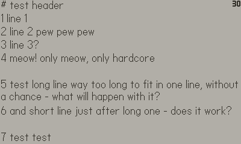

# play-reader
Simple reader app for [play.date](https://play.date).  

# How-to use
Initial screen shows list of readable files.  
`Button A` opens selected file. Scrollable via d-pad or crank.  
`Button B` returns to files list. 

# Adding new file
Readable text files: `.txt`, `.md`, `.adoc`, `.rst`.  

To add new book you'll need to add it in `Source` folder, and then [re-compile project](https://sdk.play.date/1.10.0/Inside%20Playdate.html#_compiling_a_project) (`pdc play-reader/Source`). 

>Behind the scenes, there are two directories your game has access to: the root of your app bundle (read-only), and a Data directory unique to your game (readable and writeable) where you can store your game’s saved state or other data.

# Todo
- [ ] selectable fonts
- [ ] ensure no excess redraws made/no battery waste 